# Crypto Finance - Assessment 2

#### Last Update August 26, 2021 ####
#### Matteo Bottacini, [bottacinimatteo@gmail.com](mailto:bottacinimatteo@gmail.com) ####


## Report
Here are the answer for the differents tasks:
1. [Task 1](#task-1)
2. [Task 2](#task-2)


### Task 1
The task is solved by creating a self-function for each step, to make it more readable and user friendly.

All the functions are in [utils1.py](../CryptoFinance_assessment2/src/utils1.py).

Link to the answers:
1. [Task 1.a](#task-1a)
2. [Task 1.b](#task-1b)
3. [Task 1.c](#task-1c)
4. [Task 1.d](#task-1d)
5. [Task 1.e](#task-1e)
6. [Task 1.f](#task-1f)
7. [Task 1.g](#task-1g)
8. [Task 1.h](#task-1h)
9. [Task 1.i](#task-1i)


#### Task 1.a: 
#### Merge both datasets using the common variable and sort the data by timestamp.

the function is `merge_dataset()` and in specific the steps are the following:

1. Access the directory containing the data.
2. Read the `.csv` files with `pandas.read_csv()`.
3. Sort the values by `timestamp`.

The for loop is used to make this function working even with more than 2 `.csv` files.

```python
# 1.a. merge dataset
def merge_dataset(local_folder, data_folder, df1='data_nonfiltrata_a.csv', df2='data_nonfiltrata_b.csv'):

    # import modules
    import pandas as pd
    import os

    # folder path
    folder_path = os.path.abspath(os.getcwd())
    folder_path = folder_path.replace(local_folder, data_folder)

    # merge data
    elements = [df1, df2]

    flag = False
    for element in elements:
        file_path = folder_path + '/' + element

        if not flag:
            df = pd.read_csv(file_path, index_col=0)
            flag = True
        else:
            df2 = pd.read_csv(file_path, index_col=0)
            df = df.merge(df2)
            df.sort_values('timestamp')

    print('Task 1.a: Merge both datasets using the common variable and sort the data by timestamp: DONE')
    return df
```

#### Task 1.b: 
#### Use the result of 1. a.) and omit/delete all data points (entire row) if they contain a NA or NaN. Do you also find potential data errors in the timestamp? If so, delete this data as well. How many rows does your new dataset have after these cleaning steps?

the function is `clean_data()` and in specific the steps are the following:

1. Store the initial length of the table into a variable.
2. Drop the NA values with the function `padnas.dropna(axis=1)` so that is a row contain an NA, all the row is deleted.
3. Drop values with potential data errors in the timestamp (in this case the last one) by looking at the data.
4. Store the final length of the table into a variable.
5. Print the number of rows deleted in the enviornment such that everyone can see it in the `logs`.

```python
# 1.b. clean data
def clean_data(merged_df):

    # drop NA
    len_init = len(merged_df)
    df = merged_df.dropna(axis=0)[:-1]
    len_final = len(df)

    print('Task 1.b: clean data: DONE')
    print('final length: ' + str(len_final) + ' , row deleted: ' + str(len_init - len_final))

    return df
```

#### Task 1.c:
#### Use the cleaned data set and create a new variable timestamp_CET, which puts the variable timestamp into a reader-friendly datetime format. The time zone should be Central European Time (CET) and don't forget the milliseconds.

the function is `timestamp_CET()` and in specific the steps are the following:

1. convert timestamp column to `datetime` with specified `unit=us`.
2. Set time zone CET by saving the new column with `.astype("datetime64[ns, CET]")`

```python
def timestamp_CET(df):

    # import modules
    import pandas as pd

    # add CET timestamp data
    df['timestamp_CET'] = pd.to_datetime(df['timestamp'], unit='us')
    df['timestamp_CET'] = df['timestamp_CET'].astype("datetime64[ns, CET]")

    print('Task 1.c: add Timestamp CET data: DONE')
    return df
```

#### Task 1.d:
#### Now make a plot. Don't forget to label the plot in a comprehensible way (title, axes, etc.). The plot consists of two subplots. The upper subplot shows the price development over time (y-axis: price; x-axis: timestamp_CET). The lower subplot shows the volume over time (y-axis: amount; x-axis: timestamp_CET).

the function is `price_amount_plot()` and in specific the steps are the following:

1. Set the directory where the plot will be saved using the module `os`.
2. Performing the plot by setting each parameter.

The goal of a nice plot is to be clear at the first sight. Thus, I removed all the un

```python
# 1.d. plot
def price_amount_plot(df, local_folder):

    # import modules
    import matplotlib.pyplot as plt
    from matplotlib.ticker import ScalarFormatter, FormatStrFormatter
    import os

    # folder path
    folder_path = os.path.abspath(os.getcwd())
    folder_path = folder_path.replace(local_folder, 'reports/task1/images/')

    # file name and path
    file_name = df.symbol.unique()[0]
    file_path = folder_path + file_name + '.pdf'

    # plot
    plt.rcParams['font.family'] = 'serif'  # set font family: serif

    fig, ax = plt.subplots(2, 1, figsize=(15, 10))
    fig.text(s=df.symbol.unique()[0] + ' \n Price and Volume dynamics',
             x=0.5, y=0.95, fontsize=20, ha='center', va='center')
    ax[0].plot(df['timestamp_CET'], df['price'])
    ax[1].plot(df['timestamp_CET'], df['amount'])
    fig.text(0.06, 0.7, df.symbol.unique()[0], ha='center', va='center', rotation='vertical')
    fig.text(0.06, 0.3, 'Volume', ha='center', va='center', rotation='vertical')
    ax[0].tick_params(axis='x', which='both', bottom=False, top=False, labelbottom=False)
    ax[0].margins(x=0)
    ax[1].margins(x=0)
    ax[1].margins(y=0)
    ax[1].spines['bottom'].set_visible(False)
    ax[1].spines['right'].set_visible(False)
    ax[1].spines['top'].set_visible(False)
    ax[0].spines['bottom'].set_visible(False)
    ax[0].spines['right'].set_visible(False)
    ax[0].spines['top'].set_visible(False)
    ax[1].yaxis.set_major_formatter(FormatStrFormatter('%.0f'))
    plt.savefig(file_path, dpi=160)  # save fig
    plt.close()

    return print('Task 1.d: Plot Price and Volume: DONE')
```
The goal of a nice plot is to be clear at the first sight. Thus, I removed all the elements that I believe are not necessary to understand a plot, to make the plot cleaner and clearer.
Furthemore, I also change the font into `Serif` (I like it :D).

Here is the result:
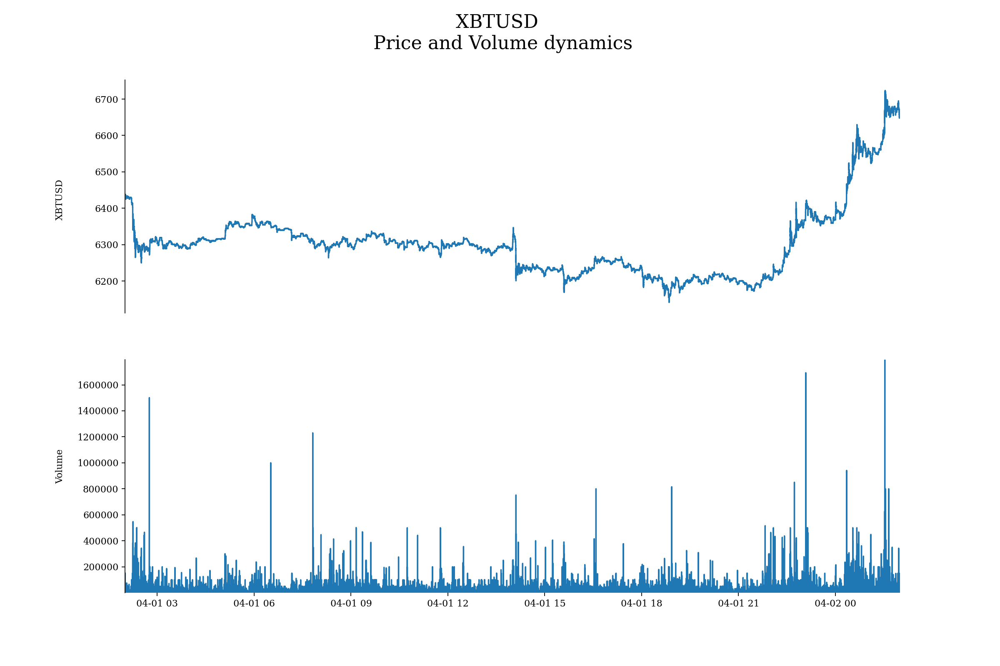

#### Task 1.e.
#### Clean the outliers in variable amount. Which procedure do you use and why? Show a boxplot and a descriptive summary of the amounts before and after the outlier cleaning.

I consider outliers all the values greater than 3 standard deviation from the sample mean.
the function is `price_amount_plot()` and in specific the steps are the following:

1. Access the folder where to store the results, both `tables` and `images`.
2. Taking into account only observations whose absolute `z-score` is smaller than 3.
3. Evaluate summary statistics to spot differences.
4. Plot the results.

```python
# 1.e. Clean the outliers in variable amount
def remove_outliers(df, feature, local_folder):

    # import modules
    import pandas as pd
    from scipy import stats
    import numpy as np
    import os
    import matplotlib.pyplot as plt
    from matplotlib.ticker import ScalarFormatter, FormatStrFormatter

    # folder path
    folder_path = os.path.abspath(os.getcwd())
    folder_path_table = folder_path.replace(local_folder, 'reports/task1/tables/')
    folder_path_plot = folder_path_table.replace('tables', 'images')

    # file name and path
    file_name = df.symbol.unique()[0] + '_' + feature
    file_path_table = folder_path_table + file_name + '.csv'
    file_path_plot = folder_path_plot + file_name + '.png'

    # z-scores
    z_scores = stats.zscore(df[feature])

    # filter obs < 3 std
    abs_z_scores = np.abs(z_scores)
    filtered_entries = (abs_z_scores < 3)
    new_feature = df[feature][filtered_entries]

    # summary statistics
    summary_init = df[feature].describe()
    summary_final = new_feature.describe()
    summary_stat = pd.concat([summary_init, summary_final], axis=1)
    summary_stat.columns = ['with_outliers', 'no_outliers']

    # create .csv summary statistics
    summary_stat.to_csv(file_path_table)
    print('Summary statistics ' + feature + ': DONE')

    # box plot
    df_box_plot = [df[feature], new_feature]
    plt.rcParams['font.family'] = 'serif'  # set font family: serif
    fig, ax = plt.subplots(1, 1, figsize=(15, 10))
    fig.text(s=df.symbol.unique()[0] +
               ' Volume Boxplot \n Outlier: value greater than 3 standard deviations from the mean',
             x=0.5, y=0.95, fontsize=20, ha='center', va='center')
    bp = ax.boxplot(df_box_plot, patch_artist=True)
    for box in bp['boxes']:
        box.set(color='#7570b3', linewidth=2)
        box.set(facecolor='#1b9e77')
    for whisker in bp['whiskers']:
        whisker.set(color='#7570b3', linewidth=2)
    for cap in bp['caps']:
        cap.set(color='#7570b3', linewidth=2)
    for median in bp['medians']:
        median.set(color='#b2df8a', linewidth=2)
    for flier in bp['fliers']:
        flier.set(marker='o', color='#e7298a', alpha=0.5)
    ax.set_xticklabels(['With Outliers', 'Without Outliers'])
    ax.spines['bottom'].set_visible(False)
    ax.spines['right'].set_visible(False)
    ax.spines['top'].set_visible(False)
    ax.tick_params(axis='x', which='both', bottom=False, top=False)
    ax.yaxis.set_major_formatter(FormatStrFormatter('%.0f'))
    fig.text(0.06, 0.5, 'Volume', ha='center', va='center', rotation='vertical')
    plt.savefig(file_path_plot, dpi=80)  # save fig
    plt.close()

    # box plot without outliers alone
    fig, ax = plt.subplots(1, 1, figsize=(15, 10))
    fig.text(s=df.symbol.unique()[0] +
               ' Volume Boxplot \n Outlier: value greater than 3 standard deviations from the mean',
             x=0.5, y=0.95, fontsize=20, ha='center', va='center')
    bp = ax.boxplot(new_feature, patch_artist=True)
    for box in bp['boxes']:
        box.set(color='#7570b3', linewidth=2)
        box.set(facecolor='#1b9e77')
    for whisker in bp['whiskers']:
        whisker.set(color='#7570b3', linewidth=2)
    for cap in bp['caps']:
        cap.set(color='#7570b3', linewidth=2)
    for median in bp['medians']:
        median.set(color='#b2df8a', linewidth=2)
    for flier in bp['fliers']:
        flier.set(marker='o', color='#e7298a', alpha=0.5)
    ax.set_xticklabels(['Without Outliers'])
    ax.spines['bottom'].set_visible(False)
    ax.spines['right'].set_visible(False)
    ax.spines['top'].set_visible(False)
    ax.tick_params(axis='x', which='both', bottom=False, top=False)
    ax.yaxis.set_major_formatter(FormatStrFormatter('%.0f'))
    fig.text(0.06, 0.5, 'Volume', ha='center', va='center', rotation='vertical')
    plt.savefig(file_path_plot.replace('.png', '_no_outliers.png'), dpi=80)  # save fig
    plt.close()

    print('Boxplot ' + feature + ': DONE')
    return print('Task 1.e: Clean the outliers in the variable ' + feature + ': DONE')
```

Accessing the results in: [XBTUSD_summary.csv](../reports/task1/tables/XBTUSD_summary.csv) we can statistically appreciate that removing outliers smooth the reuslts, therefore the standard deviation is smaller and at the same way the maximum and the minimum results deviate less from the mean.

Visually, comparing the two distribution in the same plot:
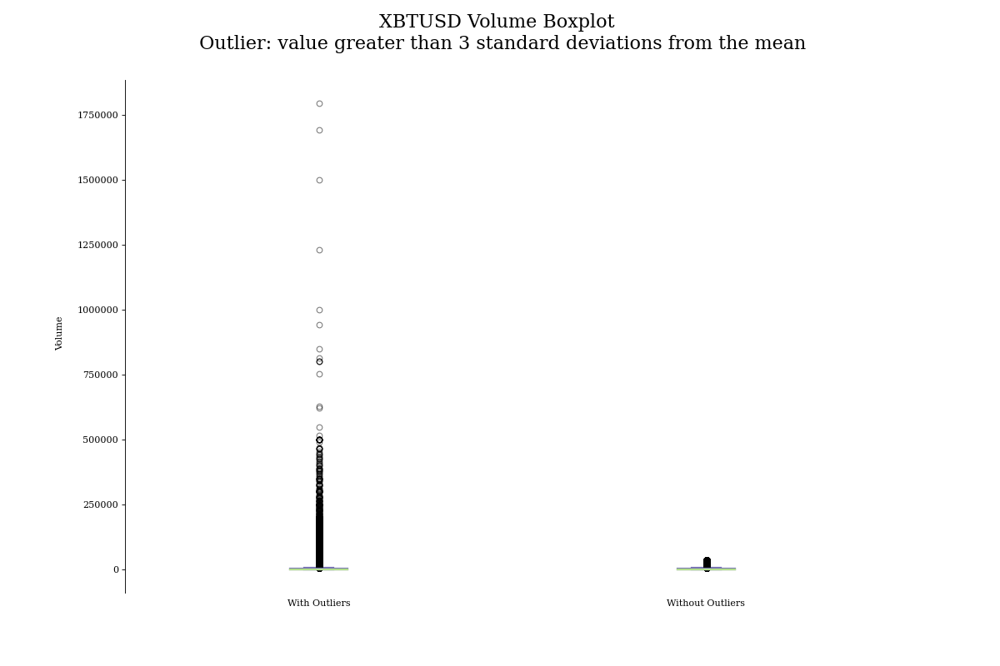

Here we can only appreciate that we remove some observations...to understand better the situation it's better to have a deep look into the distribution with no outliers only:
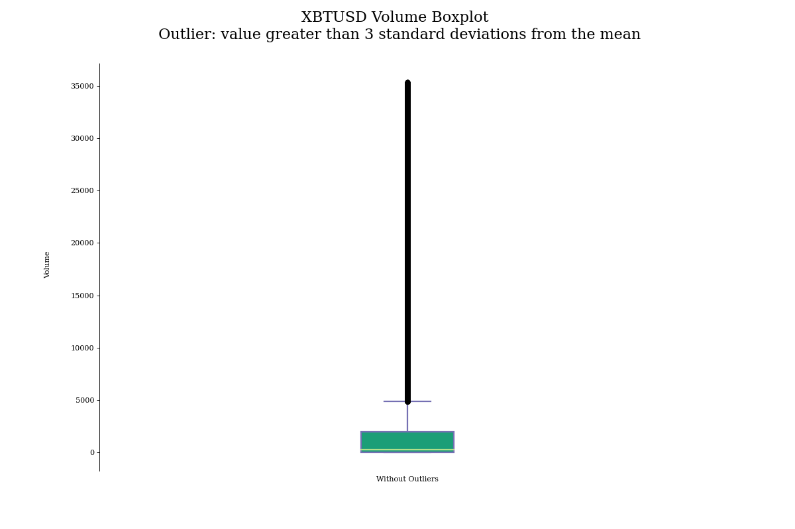


#### Task 1.f
#### Calculate a 100 point simple moving average price of your cleaned dataset in 1.d) and compare the price and the moving average.


the function is `sma()` and in specific the steps are the following:

1. Access the folder where to store the results, both `tables` and `images`.
2. Evaluate the Simple Moving Average (SMA).
3. Evaluate summary statistics to spot differences.
4. Plot the results.

```python
# 1.f. 100 point simple moving average
def sma(df, feature, N, local_folder):

    # import modules
    import numpy as np
    import pandas as pd
    import matplotlib.pyplot as plt
    import os

    # folder path
    folder_path = os.path.abspath(os.getcwd())
    folder_path_table = folder_path.replace(local_folder, 'reports/task1/tables/')
    folder_path_plot = folder_path_table.replace('tables', 'images')

    # file name and path
    file_name = df.symbol.unique()[0] + '_' + feature + '_sma' + str(N)
    file_path_table = folder_path_table + file_name + '.csv'
    file_path_plot = folder_path_plot + file_name + '.png'

    # Simple Moving Average (SMA)
    x = df[feature].values
    cumsum = np.cumsum(np.insert(x, 0, 0))
    sma = pd.Series((cumsum[N:] - cumsum[:-N]) / float(N))

    # append values
    value = pd.Series(np.zeros(N-1))
    value = value.replace(0, np.nan)
    sma = value.append(sma)
    df['sma_' + str(N)] = sma.values

    # comparing summary statistics
    summary_sma = sma.dropna().describe()
    summary_feature = df[feature].describe()
    summary_stat = pd.concat([summary_feature, summary_sma], axis=1)
    summary_stat.columns = [feature, 'SMA_' + str(N)]
    summary_stat.to_csv(file_path_table)

    # plot
    plt.rcParams['font.family'] = 'serif'  # set font family: serif
    fig, ax = plt.subplots(1, 1, figsize=(15, 10))
    fig.text(s=df.symbol.unique()[0] + ' \n' + feature + ' vs SMA ' + str(N),
             x=0.5, y=0.95, fontsize=20, ha='center', va='center')
    ax.plot(df['timestamp_CET'], df[feature])
    ax.plot(df['timestamp_CET'], sma)
    fig.text(0.06, 0.5, feature, ha='center', va='center', rotation='vertical')
    ax.margins(x=0)
    ax.spines['right'].set_visible(False)
    ax.spines['top'].set_visible(False)
    ax.legend([feature, 'SMA ' + str(N)], bbox_to_anchor=(.5, 0.03),
              loc="lower center", bbox_transform=fig.transFigure, ncol=2, frameon=False)
    plt.savefig(file_path_plot, dpi=160)  # save fig
    plt.close()

    print('Task 1.f: ' + feature + ' and SMA ' + str(N) + ' comparison: DONE')
    return df
```

Having into account tick by tick data, a rolling window of 100 observations could be too tiny to graphically see the differences.
By the way, statistically, the SMA is smoother and less volatile than the close prices.

The summary statistics with all the comparison are [here](../reports/task1/tables/XBTUSD_price_sma100.csv).
This is the plot:
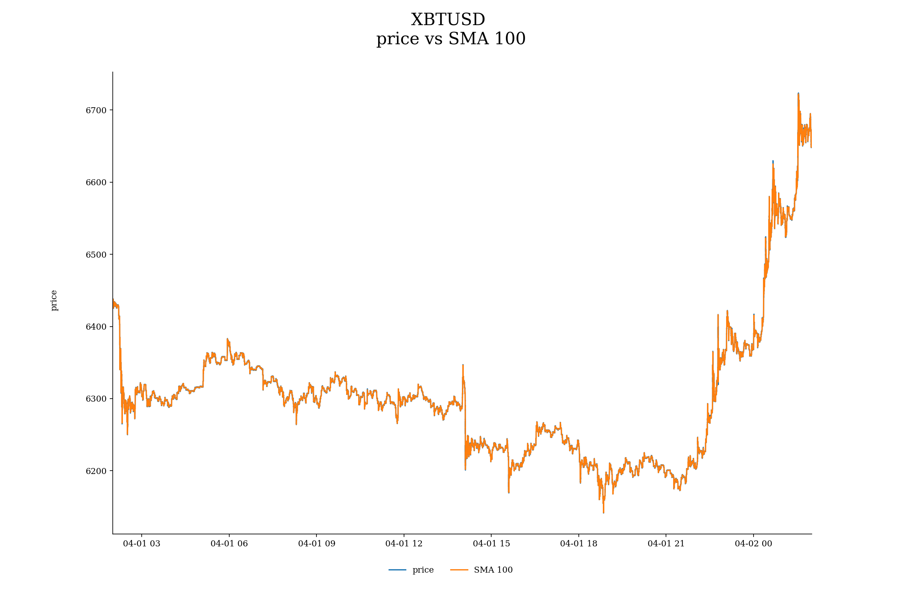

#### Task 1.g.
#### Calculate a 100 point amount weighted moving average price of your cleaned dataset in 1.d) and compare the price and the moving average of 1.f) and the amount weighted moving average price.

the function is `wma()` and in specific the steps are the following:

1. Access the folder where to store the results, both `tables` and `images`.
2. Evaluate the Weighted Moving Average (WMA) with a rolling approach.
3. Evaluate summary statistics to spot differences.
4. Plot the results.

```python
# 1.g. 100 point weighted moving average
def wma(df, feature, weight, N, local_folder):

    # import modules
    import numpy as np
    import pandas as pd
    import matplotlib.pyplot as plt
    import os

    # folder path
    folder_path = os.path.abspath(os.getcwd())
    folder_path_table = folder_path.replace(local_folder, 'reports/task1/tables/')
    folder_path_plot = folder_path_table.replace('tables', 'images')

    # file name and path
    file_name = df.symbol.unique()[0] + '_' + feature + '_wma' + str(N)
    file_path_table = folder_path_table + file_name + '.csv'
    file_path_plot = folder_path_plot + file_name + '.png'

    # Weighted Moving Average (WMA)
    cumsum = (df[weight] * df[feature]).cumsum()
    cumdiv = df[weight].cumsum()
    wma = (cumsum / cumdiv).rolling(window=N).mean()
    df['wma_' + str(N)] = wma.values

    # comparing summary statistics
    summary_wma = wma.dropna().describe()
    summary_feature = df[feature].describe()
    summary_stat = pd.concat([summary_feature, summary_wma], axis=1)
    summary_stat.columns = [feature, 'WMA_' + str(N)]
    summary_stat.to_csv(file_path_table)

    # plot
    plt.rcParams['font.family'] = 'serif'  # set font family: serif
    fig, ax = plt.subplots(1, 1, figsize=(15, 10))
    fig.text(s=df.symbol.unique()[0] + ' \n' + feature + ' vs WMA ' + str(N),
             x=0.5, y=0.95, fontsize=20, ha='center', va='center')
    ax.plot(df['timestamp_CET'], df[feature])
    ax.plot(df['timestamp_CET'], wma)
    fig.text(0.06, 0.5, feature, ha='center', va='center', rotation='vertical')
    ax.margins(x=0)
    ax.spines['right'].set_visible(False)
    ax.spines['top'].set_visible(False)
    ax.legend([feature, 'WMA ' + str(N)], bbox_to_anchor=(.5, 0.03),
              loc="lower center", bbox_transform=fig.transFigure, ncol=2, frameon=False)
    plt.savefig(file_path_plot, dpi=160)  # save fig
    plt.close()

    print(feature + ' and WMA ' + str(N) + ' comparison: DONE')
    return df
```

Since the results are weighted by the volume we can now appreciate a trend in the data that we can use as a source for our trading and hedging strategies.
Therefore, after an inital declining the ratio has been almost stable is 04/02 where price started booming more than the volumes.

The summary statistics with all the comparison are [here](../reports/task1/tables/XBTUSD_price_wma100.csv).
This is the plot:
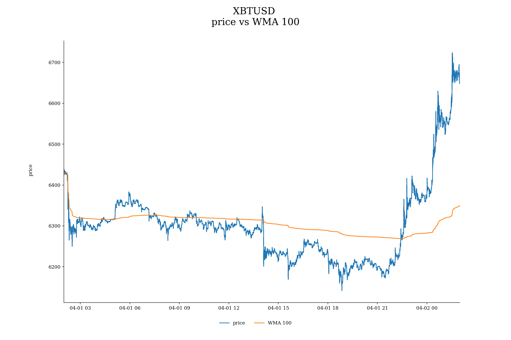

#### Task 1.h
#### Derive your own 15min OHLC data from your cleaned dataset in 1.d). and plot the data as candlesticks or barcharts.

the function is `ohlc()` and in specific the steps are the following:

1. Access the folder where to store the results, both `tables` and `images`. 
2. Resample data based on the desired `time_interval` and group them by `OHLC`.
3. Prepare the data for the module `finplot`.
4. Plot the results

```python
# 1.h. 15min OHLC
def ohlc(df, time_interval, local_folder):

    # import modules
    import finplot as fplt
    import os

    # folder path
    folder_path = os.path.abspath(os.getcwd())
    folder_path_table = folder_path.replace(local_folder, 'reports/task1/tables/')
    file_path = folder_path_table + 'OHLC_data.csv'

    # derive OHLC data with
    df = df.set_index('timestamp_CET')
    df_ohlc = df['price'].resample(time_interval).ohlc()
    df_ohlc.to_csv(file_path)

    # OHLC plot
    ax = fplt.create_plot(df.symbol.unique()[0], rows=1, maximize=True)
    ax.setLabel('left', 'Price')
    fplt.candlestick_ochl(df_ohlc[['open', 'close', 'high', 'low']])
    fplt.show()
    fplt.close()

    print('Task 1.h: derive my own ' + time_interval + ' OHLC data from your cleaned dataset in 1.d: DONE')
    return df_ohlc
```

Resampling make it easy to create OHLC data with different time intervals (p.s. it's nice to try even different timeframes).
To analyze results that are useful for the TA I prefer the module `finplot` instead of the most typical `matplotlib`. This module makes plots interactive, thus perfect for any kind of analysis.

This is the main plot obtained:
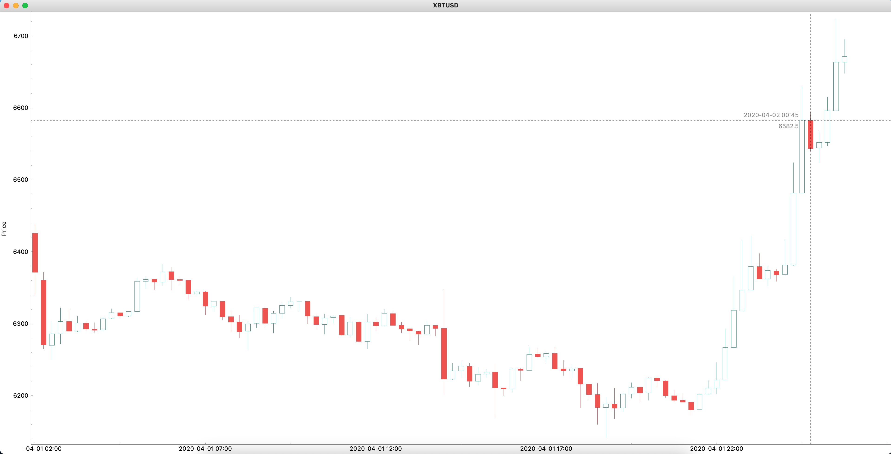

As an example of the interactiveness:
- with the right click is possible to zoom a specific area!:
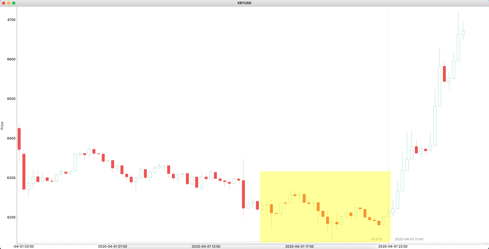
  
And this will be the result:
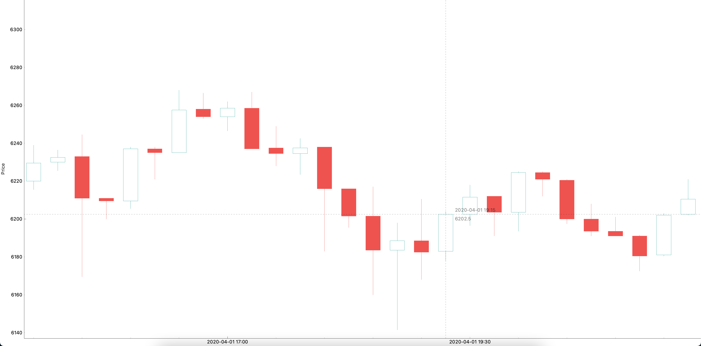

Of course there is plenty of possibility, I encourage you to have a look at the documentation if you don't know this module yet.

#### Task 1.i
#### Derive your own 15min median and amount weighted price from your cleaned dataset in 1.d). Compare the mediam, amount weighted price and the Close price of 1.f.) with each other.

the function is `comparison()` and in specific the steps are the following:

1. Access the folder where to store the results, both `tables` and `images`. 
2. Compute the median and the WMA according to the `time_interval`.
3. Evaluate some summary statistics to compare the results.
4. Plot the results.

```python
def comparison(df, time_interval, feature, weight, N, local_folder):

    # import modules
    import pandas as pd
    import os
    import matplotlib.pyplot as plt

    # folder path
    folder_path = os.path.abspath(os.getcwd())
    folder_path_table = folder_path.replace(local_folder, 'reports/task1/tables/')
    folder_path_plot = folder_path_table.replace('tables', 'images')

    # file name and path
    file_name = df.symbol.unique()[0] + '_summary'
    file_path_table = folder_path_table + fil_name + '.csv'
    file_path_plot = folder_path_plot + file_name + '.png'

    # min interval
    df.reset_index(inplace=True)
    df.set_index('timestamp_CET', inplace=True)
    price_median = df['price'].resample(time_interval).median()
    df['median_' + time_interval] = price_median
    cumsum = (df[weight] * df[feature]).cumsum()
    cumdiv = df[weight].cumsum()
    wma = (cumsum / cumdiv).rolling('15min').mean()
    df['wma_' + time_interval] = wma

    # summary statistics
    summary_price_median = price_median.describe()
    summary_wma_min = df['wma_' + time_interval].describe()
    summary_wma_N = df['wma_' + str(N)].describe()
    summary_close_price = df['price'].describe()
    summary = pd.DataFrame([summary_price_median, summary_wma_min, summary_wma_N, summary_close_price]).T
    summary.columns = [time_interval + '_close_price_median', 'wma_' + time_interval, 'wma_' + str(N), 'close_price']
    summary.to_csv(file_path_table)

    # plot
    plt.rcParams['font.family'] = 'serif'  # set font family: serif
    fig, ax = plt.subplots(1, 1, figsize=(15, 10))
    fig.text(s=df.symbol.unique()[0] +
               ' \n Close Price, ' + time_interval + 'Median Price, ' + 'WMA ' + time_interval + ', WMA ' + str(N),
             x=0.5, y=0.95, fontsize=20, ha='center', va='center')
    ax.plot(df['price'])
    ax.plot(df['median_' + time_interval])
    ax.plot(df['wma_' + time_interval])
    ax.plot(df['wma_' + str(N)])
    fig.text(0.06, 0.5, 'Price', ha='center', va='center', rotation='vertical')
    ax.margins(x=0)
    ax.spines['right'].set_visible(False)
    ax.spines['top'].set_visible(False)
    ax.legend(['Close Price', 'Price Median ' + time_interval, 'WMA ' + time_interval, 'WMA ' + str(N)],
              bbox_to_anchor=(.5, 0.03), loc="lower center", bbox_transform=fig.transFigure, ncol=4, frameon=False)
    plt.savefig(file_path_plot, dpi=160)  # save fig
    plt.close()

    print('Task 1.i: final comparison: DONE')

    return df
```

The summary statistics with all the comparison are [here](../reports/task1/tables/XBTUSD_summary.csv).
This is the plot:
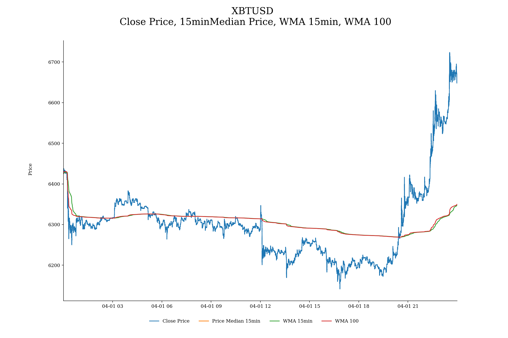


### Task 2
The task is solved by creating a self-function for each step, to make it more readable and user-friendly.

All the functions are in [utils2.py](../CryptoFinance_assessment2/src/utils2.py).

Link to the answers:
1. [Task 2.a](#task-2a)
2. [Task 2.b](#task-2b)
3. [Task 2.c](#task-2c)

#### Task 2.a
#### Get the 60 min market data of the last 360 days for “ETH/USD” and “BTC/USD”. Merge the datasets to one dataset.

The function are `historical_data()` together with the loop in the function `task2()`.
The first depends on 3 key variables (i) market, (ii) days and (iii) interval.
Therefore, `market` is a string or a list of strings indicating the  market that we want to download, `days` is an integer and is the number of that `n` days that we want to analyze and `interval` is the time between an observation and the following one expressed in hours (e.g. 1 = 1hour, 0.5 = 30min, ...).

The steps are the following:
1. Retrieve the `start_date` and the `end_date`.
2. Finding the number of iterations to perform since the API enables `1500` downloads per time.
3. Loop every `1500` entries to download all the data we need.
4. Append the result at every iteration.
5. set `starTime` as index to merge data.

```python
# get historical data
def historical_data(market, days, interval):

    # import modules
    import requests
    import json
    import pandas as pd
    from datetime import datetime, timedelta, timezone
    import math

    # end date and start date
    end_date = datetime.now().replace(microsecond=0, second=0, minute=0)
    start_date = end_date - timedelta(days=days)

    iterations = math.ceil(days / (1500 / 24 * interval))
    flag = False
    for i in range(0, iterations):

        # start, end timestamps
        end = start_date + timedelta(hours=1500)

        # for next iteration
        start_date = end

        # int
        start = int((end-timedelta(hours=1500)).replace(tzinfo=timezone.utc).timestamp())
        end = int(end.replace(tzinfo=timezone.utc).timestamp())

        # API request
        request = requests.get('https://ftx.com/api/markets/' + market + '/candles?resolution=3600&start_time=' +
                               str(start) + '&end_time=' + str(end))
        result = json.loads(request.text)

        if not flag:  # first iteration only
            df = pd.json_normalize(result['result'])
            flag = True
        else:  # then append
            df2 = pd.json_normalize(result['result'])
            df = pd.concat([df, df2])
            del df2

        # next iteration
        i += 1

    # adjust df columns and names
    df.set_index('startTime', inplace=True)
    df.columns = df.columns +  '_' + market

    print(market + ' ' + str(interval) + ' hour data for the last ' + str(days) + ' days: DONE')
    return df
```

The loop to merge the data is the following:
The function enables to merge more than 2 different markets, as well as keeping only one.
```python
    # task 2.a
    flag = False
    if len(markets) > 1:
        for market in markets:
            if not flag:
                df = historical_data(market=market, days=days, interval=interval)
                flag = True
            else:
                df2 = historical_data(market=market, days=days, interval=interval)
                df = df.join(df2)
                del df2
    else:
        df = historical_data(market=markets, days=days, interval=interval)
    print('datasets merge: DONE')
    print('Task 2.a: DONE')
```

#### Task 2.b
#### Play around with the data (prices, returns, etc.) and show us plots and descriptive analyses of the two series. (We love labels and colours).

The function is `historical_analysis()`.

The steps are the following:
1. Evaluate the returns as the incremental innovation.
2. perform summary statistics to analyze them.
3. Plot an overlayed histogram to see the distributions and spot the first insights.
4. Evaluate rolling correlation to see the dynamics over the last year.
5. Evalaute cumulative returns to compare the performance between the two markets.
6. Plot two subplots with performance and rolling correlation
7. Evaluate the daily realized volatility as the sum of the squared returns over a day.
8. Plot the realized volatility
9. Understand the risk-adjusted performance


```python
# Task 2.b. analysis
def historical_analysis(df, markets, local_folder, interval, rolling_days, days):

    # import modules
    import pandas as pd
    import matplotlib.pyplot as plt
    import os

    # folder path
    folder_path = os.path.abspath(os.getcwd())
    folder_path_table = folder_path.replace(local_folder, 'reports/task2/tables/')
    folder_path_plot = folder_path_table.replace('tables', 'images')

    # evaluate returns
    flag = False
    for market in markets:
        if not flag:
            ret = df['close_' + market] / df['close_' + market].shift(1) - 1
            ret = pd.DataFrame(ret)
            flag = True
        else:
            ret2 = df['close_' + market] / df['close_' + market].shift(1) - 1
            ret2 = pd.DataFrame(ret2)
            ret = ret.join(ret2)
            del ret2

    # rename columns
    ret.columns = markets

    # summary statistics
    summary = ret.describe()
    file_path = folder_path_table + 'summary_statistics_ret.csv'
    summary.to_csv(file_path)

    # histogram
    file_path_plot = folder_path_plot + 'histogram_ret.png'
    plt.rcParams['font.family'] = 'serif'  # set font family: serif
    fig, ax = plt.subplots(1, 1, figsize=(15, 10))
    fig.text(s='Returns distribution' +
               ' \n Last ' + str(days) + ' days, ' + str(interval) + ' hour interval ',
             x=0.5, y=0.95, fontsize=20, ha='center', va='center')
    for market in markets:
        plt.hist(ret[market], alpha=0.5, label=market)
    ax.spines['right'].set_visible(False)
    ax.spines['top'].set_visible(False)
    ax.spines['left'].set_visible(False)
    ax.get_yaxis().set_ticks([])
    ax.legend(markets, bbox_to_anchor=(.5, 0.03), loc="lower center",
              bbox_transform=fig.transFigure, ncol=len(markets), frameon=False)
    plt.savefig(file_path_plot, dpi=160)  # save fig
    plt.close()

    # rolling correlations
    rolling_correlation = ret[markets[0]].rolling(interval*24*rolling_days).corr(ret[markets[1]])

    # cumulative performance
    cum_ret = (1 + ret).cumprod()

    # realized volatility
    ret.index = pd.to_datetime(ret.index)
    realized_volatility = (ret ** 2).resample('D').sum()

    # realized volatility plot
    file_path_plot = folder_path_plot + 'realized_volatility.png'
    plt.rcParams['font.family'] = 'serif'  # set font family: serif
    fig, ax = plt.subplots(1, 1, figsize=(15, 10))
    fig.text(s='Realized Volatility' +
               ' \n Last ' + str(days) + ' days, ' + str(interval) + ' hour interval returns squared',
             x=0.5, y=0.95, fontsize=20, ha='center', va='center')
    ax.plot(realized_volatility)
    ax.margins(x=0)
    ax.spines['right'].set_visible(False)
    ax.spines['top'].set_visible(False)
    ax.legend(markets, bbox_to_anchor=(.5, 0.03), loc="lower center",
              bbox_transform=fig.transFigure, ncol=len(markets), frameon=False)
    fig.text(0.06, 0.5, 'Realized Volatility', ha='center', va='center', rotation='vertical')
    plt.savefig(file_path_plot, dpi=160)  # save fig
    plt.close()

    # performance & rolling correlations
    file_path_plot = folder_path_plot + 'performance_and_rolling_correlation.png'
    plt.rcParams['font.family'] = 'serif'  # set font family: serif
    fig, ax = plt.subplots(2, 1, figsize=(15, 10))
    fig.text(s='Cumulative Returns' +
               ' \n Last ' + str(days) + ' days',
             x=0.5, y=0.95, fontsize=20, ha='center', va='center')
    ax[0].plot(cum_ret)
    ax[1].plot(rolling_correlation, color='black')
    ax[0].margins(x=0)
    ax[1].margins(x=0)
    ax[0].spines['right'].set_visible(False)
    ax[0].spines['top'].set_visible(False)
    ax[0].spines['bottom'].set_visible(False)
    ax[1].spines['right'].set_visible(False)
    ax[1].spines['top'].set_visible(False)
    ax[0].set_xticks([])
    ax[1].set_xticks([])
    x_ticks = [cum_ret.index[0], cum_ret.index[round(len(cum_ret.index)/2)], cum_ret.index[-1]]
    ax[1].set_xticks(x_ticks)
    fig.text(0.06, 0.7, 'Performance', ha='center', va='center', rotation='vertical')
    fig.text(0.06, 0.3, str(rolling_days) + 'D rolling correlation', ha='center', va='center', rotation='vertical')
    fig.legend(markets, bbox_to_anchor=(.5, 0.03), loc="lower center",
              bbox_transform=fig.transFigure, ncol=len(markets), frameon=False)
    plt.savefig(file_path_plot, dpi=160)  # save fig
    plt.close()

    print('Task 2.b: DONE')
    return ret, rolling_correlation, realized_volatility
```

Now let's have a look at some plots!

The first is the histogram of the returns. Here we can immediately appreciate the skewness and the leverage effects of the returns.
As well as understanding quite immediately the trends and the volatility. Here are the [summary statistics](../reports/task2/tables/summary_statistics_ret.csv)

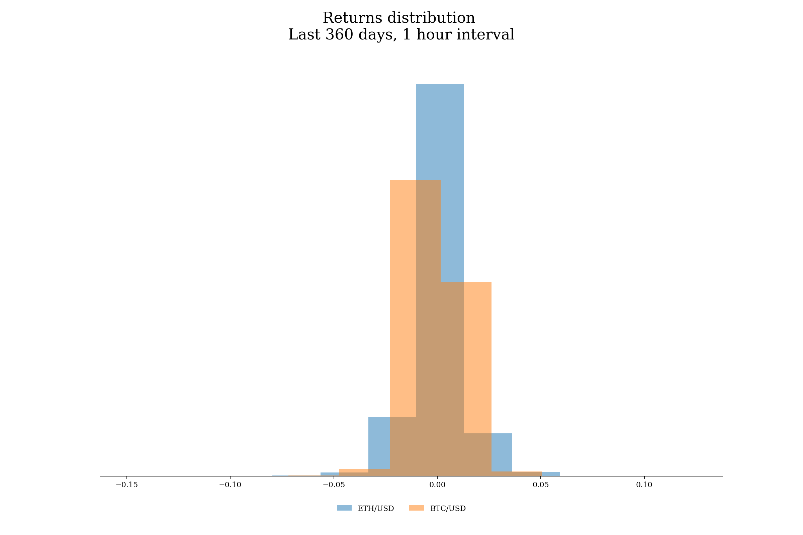

Then, Let's have a look at the cumulative performance and at the rolling correlation.
We can appreciate that ETH/USD produces hihger performance, while keeping the correlation between the two always over 65% over a 30 days rolling window.
By the way there were important deviation from the mean and also from the median value of the correlation. Further studies about the spillovers effects and the co-movements could be beneficial in terms of risk-management and also mean-reverting trading strategies.

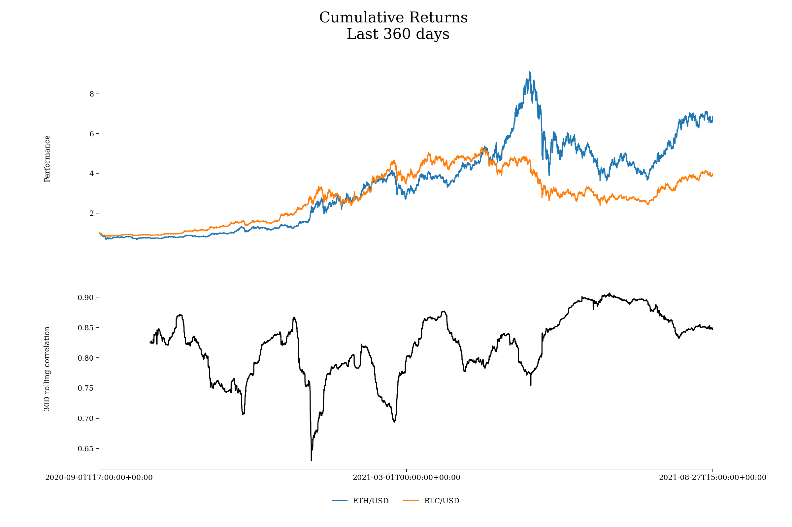

Finally, the realized volatility. As expcted they are very similar with ETH/USD being more volatile.
We can appreicate clustes and mean-reverting volatility effects, thus is important to look at the risk asjusted performance.
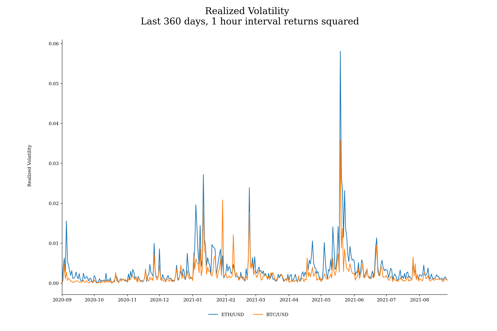


#### Task 2.c
#### Are the two series cointegrated?

The function is `cointegration_test()`.

With the help of the package `statsmodels.tsa.stattools` we can easily conduct the cointegration test.

```python
# Task 2.c. Cointegration test
def cointegration_test(df, local_folder):

    # import modules
    import statsmodels.tsa.stattools as ts
    import pandas as pd
    import os

    # folder path
    folder_path = os.path.abspath(os.getcwd())
    folder_path_table = folder_path.replace(local_folder, 'reports/task2/tables/')

    x = df['close_ETH/USD']
    y = df['close_BTC/USD']
    coin_result = ts.coint(x, y)

    cointegration_df = pd.DataFrame(
        {
            "t-test": [coin_result[0]],
            "p-value": [coin_result[1]],
            "crit_value_1%": [coin_result[2][0]],
            "crit_value_5%": [coin_result[2][1]],
            "crit_value_10%": [coin_result[2][2]]
    })

    cointegration_df.to_csv(folder_path_table + 'cointegration_test.csv')

    print('task 2.c.: DONE')
    return cointegration_df
```

The results are stored here: [cointegration_test](../reports/task2/tables/cointegration_test.csv)
The Null hypothesis is that there is no cointegration, the alternative hypothesis is that there is cointegrating relationship. If the pvalue is small, below a critical size, then we can reject the hypothesis that there is no cointegrating relationship.
P-values and critical values are obtained through regression surface approximation from MacKinnon 1994 and 2010.

According to the results the two series are cointegrated.


